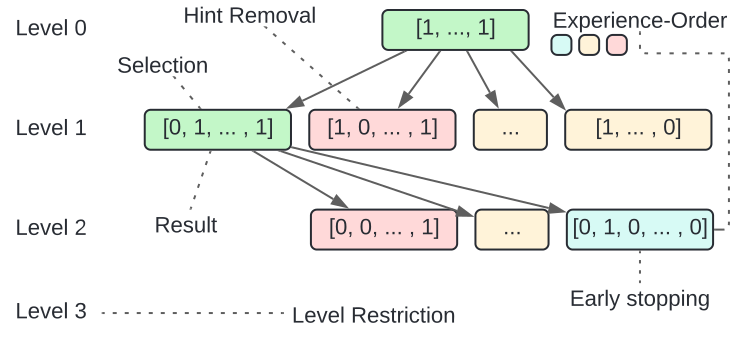

# FASTLabel

This repository contains the code used in FASTlabel, a labeling algorithm to fix the existing maintenance gap between 
supervised hinting models like FASTgres [^2] and reinforcement learning approaches like BAO [^1]. 

This code basis also contains updated functionalities of FASTgres and is still in development.

## Introduction  

FASTlabel is a modern search strategy to label queries for supervised hint set prediction.

To label an incoming query, FASTlabel determines its best fitting hint set. IN FASTgres[^2], this is done by evaluating
each set of optimizer hints, which is slow. FASTlabel finds similarly beneficial hint sets while supporting more hint
combinations and being faster.

To do so, FASTlabel uses the idea of hint set neighborhoods and a toolkit of tuning parameters. A neighborhood of a 
hint set can be generally seen as all hint sets, that differ in their hint configuration by one parameter. Simpler, when 
taking the binary representation of a hint set, a neighborhood is all hint sets that have a hamming distance of exactly 
one (differing by one bit). 

In general, FASTlabel traverses the neighboorhood of a hint set, picks the best new hint set from the neighborhood, 
and recurses. How this is done exactly is steered by following parameters:

- Selection: This parameter steers how many hint sets of a neighborhood are used for recursion. Since this parameter 
easily leads to search space explosion, we keep it at `1`, implying to only take the best hint set and continue from there. 
- Level Restriction (default: 4): FASTgres [^2] have shown that a small amount of disabled hints may already provide the 
greatest improvements for a queries' performance, if chosen correctly. Level Restriction thus steers to overall maximum 
recursions that FASTlabel performs until the search is stopped. 
- Early Stopping (default: 2, factor 1.1): This parameter is motivated by the frequently deployed similar method in learned models. 
Here, we stop our search if no better result has been observed for a set amount of recursions. However, we also deploy 
a factor based early stopping, which means that we have to observe not only better results, but also by a reasonable margin. 
- Hint Removal: Hint removal motivates from some combinations being never beneficial for a queries' performance. In this case,
 the hint sets that target such hints can be discarded. This parameter steers if hints should be removed during the labeling 
of a query. If deployed, hints are removed once their respective hint set reaches a timeout during labeling. 
- Experience: When experience is used, FASTlabel learns from previous query labelings. This means that FASTlabel sorts 
 its order of evaluation of neighborhoods by positive and negative experience. Doing so, also allows to enforce an 
aggressive timeout to prune historically badly behaving hint sets. Naturally, due to the timeouts used, this option can 
interfere with hint removal, leading to unnecessary many hints being removed.This is why we recommend not using hint 
removal and experience at the same time. 

## Evaluation Environment

FASTlabel was evaluated using a dockerized environment of PostgreSQL 12.16 and PostgreSQL 16.4 on the following 
hardware environment:

| OS | CPU | CPU Cores | Architecture | RAM | Storage |
|:--:|:---:|:---------:|:------------:|:---:|:-------:|
| CentOS 64-bit | Intel Xeon Gold 6216 | 12 | Skylake | 92 GiB | 1.8TB HDD |

We used [PGTune](https://pgtune.leopard.in.ua/) to tune our dbms according to the current best practises. 

## Reproduce Results

The fastest way to get started is by setting up your docker environment first. The standard PSQL docker image suffices. 
Build a container and import the database of your choice. We recommend [STACK](https://rmarcus.info/stack.html) and 
[JOB](https://dataverse.harvard.edu/dataset.xhtml?persistentId=doi:10.7910/DVN/2QYZBT) as we have tested them thoroughly 
ourselves.

Change the provided `config.ini` template in configs to fit your database info.

To label queries, you can run `python -m fastgres.labeling.heuristic_labeling <path/to/queries/> -o <path/to/output.csv 
-c config/ -db <imdb or stack_overflow> -dh -ue -ues -ulr`. 
This script executes the labeling algorithm using the provided query path. The `-o` option is the save path of the 
results. `-c` is the config path needed to look up your database connection and logging directory. `-db` is currently 
either `stack_overflow` or `imdb`. These parameters are used to retrieve the db info from the `config.ini` file. 
The following parameters are evaluation settings. `-dh` specifies to use default hints, which are the basic six hints 
of PSQL. This is sufficient for a fast and easy eval. Leave this option to use all hints. `ue` enables experience, 
`ues` enables early stopping, `ulr` enables level (recursion) restriction.

To run FASTgres experiments, we also provide some experiment scripts like `evaluate_workload_simple.py`, which takes 
similar inputs as `heuristic_labeling.py`. Alternatively, you can use the provided `multi_run_workload_simple.sh` to 
start multiple seeds and training splits from one script. The results can be merged and evaluated using 
`merge_multi_run_results.py` and `label_multi_run_results.py` (The labeling of multi run results can also be used for 
single runs) subsequently.

## License

This software is available under the Apache License Version 2.0.

## References

[^1]: Marcus, Ryan, et al. "Bao: Making learned query optimization practical." Proceedings of the 2021 International 
Conference on Management of Data. 2021.
[^2]: Woltmann, Lucas, et al. "FASTgres: Making Learned Query Optimizer Hinting Effective" Proceedings of the VLDB 
Endowment, Vol. 16. 2023.
[^3]: 